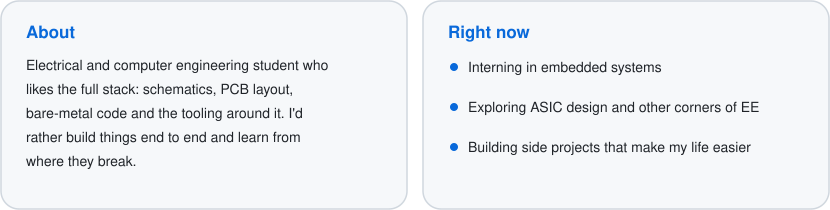
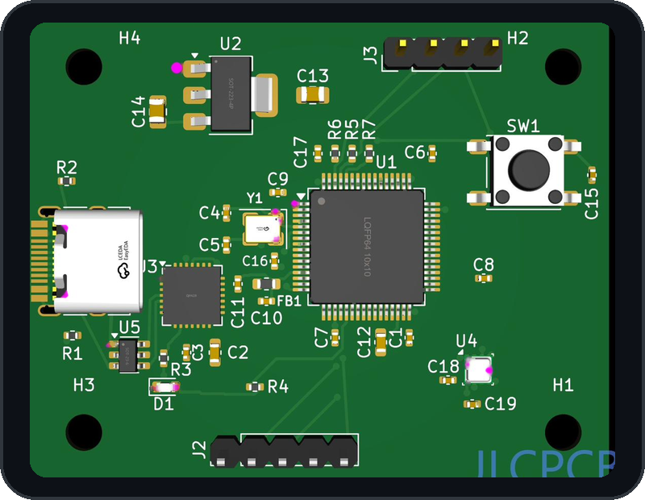
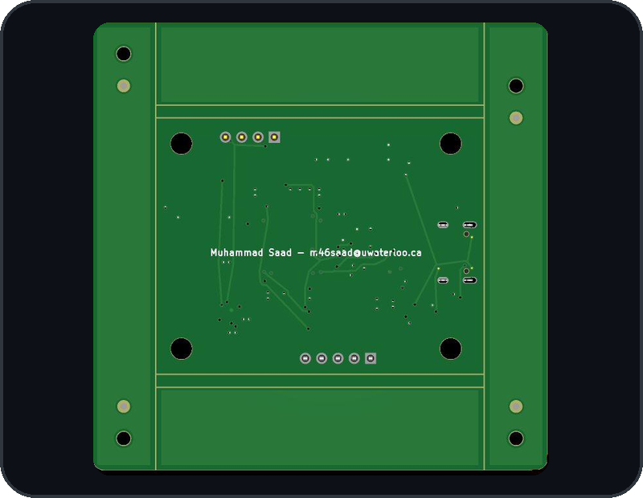

  

  

  
  

  

### Tools

  
  
  
  
  
  
  

### Selected work

  

A custom 4-layer STM32F411 board designed in KiCad, with bare-metal C firmware (direct CMSIS, no HAL) and a FreeRTOS pipeline. A BME280 sensor and an OLED share one I²C bus. Readings go out as CRC-framed packets at 921600 baud to a Python live viewer.

  

  

More projects landing here soon.

### Activity

  

  <picture>
    <source media="(prefers-color-scheme: dark)" srcset="https://raw.githubusercontent.com/saadafsy/saadafsy/output/github-snake-dark.svg" />
    <source media="(prefers-color-scheme: light)" srcset="https://raw.githubusercontent.com/saadafsy/saadafsy/output/github-snake.svg" />
    
  </picture>

